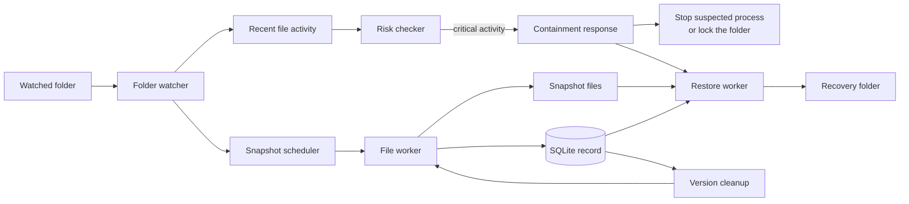

# Pegasus

Pegasus is an experimental Linux tool that watches a folder, saves file copies,
and reacts when many files start changing in a suspicious way. It is designed as
a recovery-focused prototype: preserve earlier versions first, then try to slow
or stop further damage.

## At a glance



## What it does

1. Watches one configured folder and its subfolders.
2. Waits briefly after a file changes, so it does not copy a file while it is
   still being written.
3. Saves a snapshot of the file and records it in a small SQLite database.
4. Checks whether the recent pattern of changes looks risky.
5. If the risk becomes critical, tries to stop the likely process or lock the
   watched folder, then restores older safe copies into a recovery folder.

## How Pegasus decides to react

Pegasus looks for patterns such as many quick edits, unusual changes to file
contents, renamed extensions, and similar activity across several files in one
directory. These signals are combined into three states:

| State | What it means | What Pegasus does |
| --- | --- | --- |
| `SAFE` | Activity looks ordinary. | Saves snapshots normally. |
| `WARNING` | Activity may be suspicious. | Continues saving snapshots, but marks them as potentially unsafe. |
| `CRITICAL` | Multiple signals suggest an attack. | Stops new snapshots, attempts containment, and begins recovery. |

## Main pieces

| Part | Job |
| --- | --- |
| Folder watcher | Notices file creation, edits, moves, and deletion. |
| Snapshot scheduler | Chooses when a changed file is ready to copy. |
| File worker | Creates and deletes snapshot files. |
| SQLite database | Stores the details Pegasus needs to find and manage snapshots. |
| Risk checker | Reviews recent activity for suspicious patterns. |
| Containment response | Tries to stop a suspected process; otherwise locks the folder. |
| Restore worker | Writes earlier safe snapshots to the recovery folder. |
| Version cleanup | Removes snapshots that have aged out. |

## Important limits

Pegasus is a proof of concept, not production security software.

- It runs in user space, so identifying and stopping a process is best effort.
- Detection takes a short time window, so recovery may use an older version of a
  file rather than the very latest edit.
- Thread shutdown and changes between risk states are still rough edges in this
  prototype.
- It is intended for a single configured root folder and has not been tuned for
  large real-world workloads.

## Technology

The prototype is written in Python. It uses watchdog for folder events, SQLite
for snapshot records, and background threads to keep watching, copying, checking,
and restoring work separate.

## Requirements
- Linux (tested on modern distributions)
- Python 3.10+
- POSIX filesystem with inotify support
- SQLite 3 (local file-based database)
  
- Sufficient permissions to:
  - observe filesystem events
  -  read/write monitored directories
  - attempt best-effort process inspection

## Installation and Use
- Create a .env file using .env.example as a template.

- Clone the repository:
    ```bash
        git clone https://github.com/sohamdawn7/pegasus.git
        cd pegasus
    ```
  
- Create and activate a virtual environment:
  - python3 -m venv venv
  - source venv/bin/activate

- Install dependencies:
- pip install -r requirements.txt
  
- Running Pegasus
- Start the agent:
- python -m backend.main
  
Pegasus runs as a long-lived process and begins monitoring immediately after startup.
Logs and state transitions are emitted continuously during runtime.

- Stopping the Agent
- Terminate the process manually by pressing Ctrl+C from the keyboard.

## Running Simulation (Test Script for Ransomware Behavior)
- Open a second terminal window and execute:
- python -m simulation.test_script
  
The Ransomware Test Script runs as a long running thread intended to mirror typical ransomware behavior and test the correctness of the prototype.
